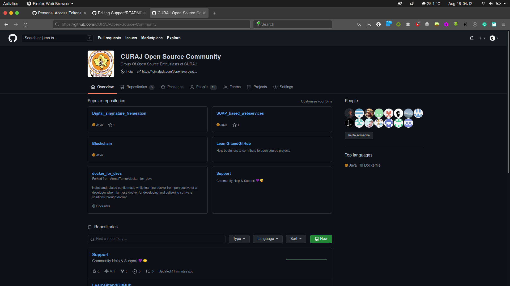
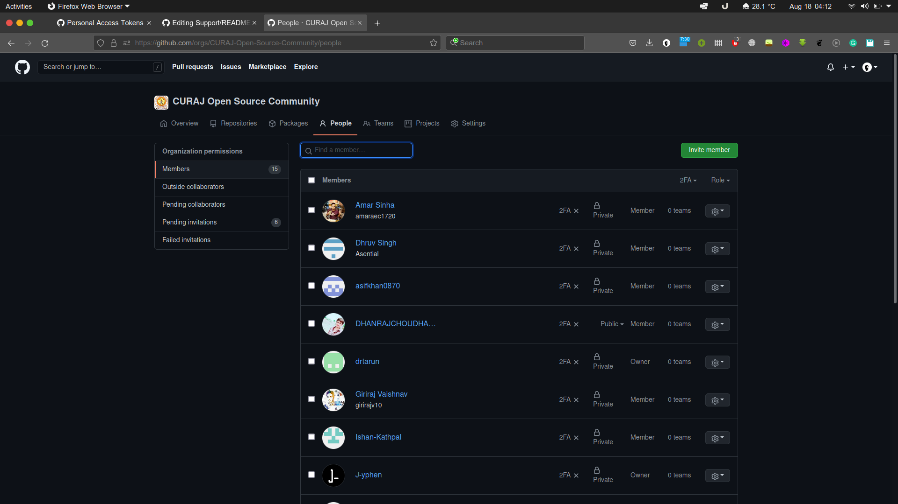
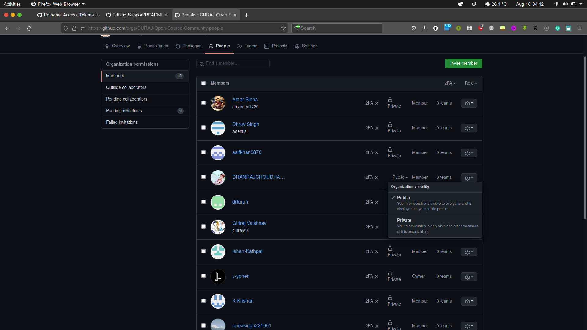

<h1 align="center"> Welcome to CURAJ Open Source Community Support</h1>

### How to join the community? 

- Raise an <code> [issue](https://github.com/CURAJ-Open-Source-Community/Support/issues/new?assignees=&labels=invite+me+to+the+organization&template=invitation.yml&title=Please+invite+me+to+the+CURAJ+Open+Source+community)</code> to join the CURAJ Open Source community.

### Why you should join this community?

- We believe that the interaction with people is very important for anyone's personal growth, Here You will get to interact with some great folks 
- You can learn together
- This community is in its initial stage so you can show your leadership skills also
- The community is diverse and inclusive

We believe that there is a learning opportunity for everyone in every question! So don't be shamed to ask your question! Join our community :)

Ask your questions in the [Discussions](https://github.com/CURAJ-Open-Source-Community/Support/discussions) 

## FAQ

**What is a GitHub Organization?**
- Organizations are where contributors can collaborate across many projects at once. An organization also allows us to group people who contribute and are a part of the community. Some examples would be: [Facebook](https://github.com/facebook), and of course [CURAJ-Open-Source-Community](https://github.com/CURAJ-Open-Source-Community).

**How do I set the Organization to Public?** You can make the organization public by: 

- Navigate to our community page: https://github.com/CURAJ-Open-Source-Community
	
- Click on the numbers that is after people:
	
	
	
- Enter your username in the searchbar:
	
	
	
- Click `Private` (the default) and set it to `Public`:
	
	
  
